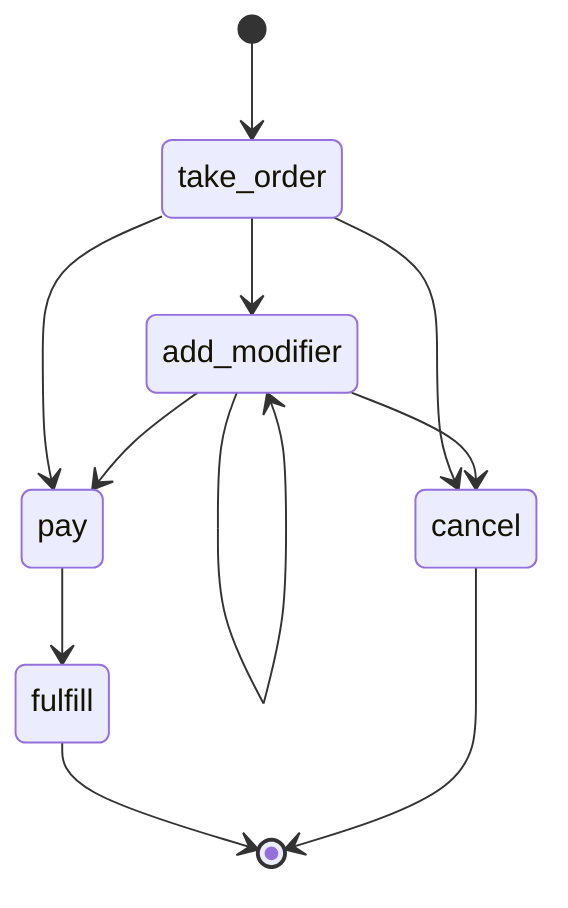
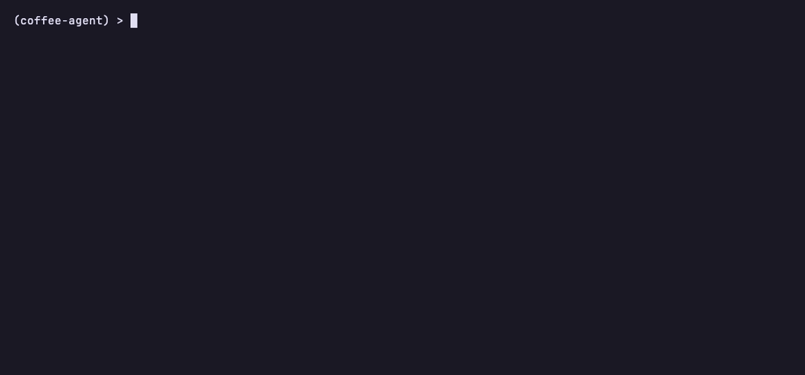

# coffee-agent

A toy agent built with [BurrMCP](https://github.com/msradam/burrmcp): a coffee
ordering workflow defined as a [Burr](https://burr.dagworks.io/) state machine
and served as an [MCP](https://modelcontextprotocol.io/) server. An LLM drives
it one transition at a time, and the server enforces the order of operations.



This diagram is the contract. The agent can only move along these edges; the
server refuses any step that is not a reachable transition. The workflow lives
in the state machine, not in a prompt the model has to remember. Pay before
ordering, or fulfill before paying, and the response is a structured refusal
listing the actions that are actually reachable.



`coffee-agent render` prints that graph in the terminal; `coffee-agent sessions
show` replays a recorded run, with refused steps in red.

## Build it yourself

This whole repo is about 90 lines. The shape:

1. `src/coffee_agent/app.py` defines the Burr graph (five `@action`s and the
   transitions between them).
2. `src/coffee_agent/cli.py` wraps it in BurrMCP's `build_cli` so the package
   ships a `coffee-agent` command with the graph baked in.
3. `pyproject.toml` depends on `burrmcp` and registers the console script.

## Install

```bash
git clone https://github.com/msradam/coffee-agent.git
cd coffee-agent
uv venv --python 3.13
uv pip install -e .
```

`coffee-agent serve` now runs the MCP server over stdio. You usually do not run
it directly; an MCP client launches it for you (below).

## Run it as an agent

The repo ships an `.mcp.json` pointing a client at `coffee-agent serve`. Pick a
client:

### Claude Code (zero extra install if you have it)

```bash
claude mcp add --transport stdio coffee-agent -- uv run coffee-agent serve
claude
```

Then ask: "Order a latte with an extra shot and pay for it." Claude calls the
`step` tool to walk the graph.

### fast-agent (a terminal REPL, Python)

```bash
uvx fast-agent-mcp go --model sonnet --servers coffee-agent
```

(reads the `.mcp.json` in the working directory). Use `--model generic.qwen2.5`
to run against a local Ollama model instead of a hosted one.

### MCPJam (one npx command, free hosted models, browser playground)

```bash
npx @mcpjam/inspector
```

Add the server with command `uv` and args `run coffee-agent serve`, then chat in
the playground.

## Watch what it did

Every step is recorded to Burr's tracker. From the repo:

```bash
uv run coffee-agent sessions ls
uv run coffee-agent sessions show         # per-step timeline, refusals in red
uv run coffee-agent watch                 # live-tail a running session
```

`coffee-agent` inherits these observability commands from BurrMCP.

## License

Apache 2.0. Built on [BurrMCP](https://github.com/msradam/burrmcp),
[Apache Burr](https://github.com/apache/burr), and
[FastMCP](https://github.com/jlowin/fastmcp).
